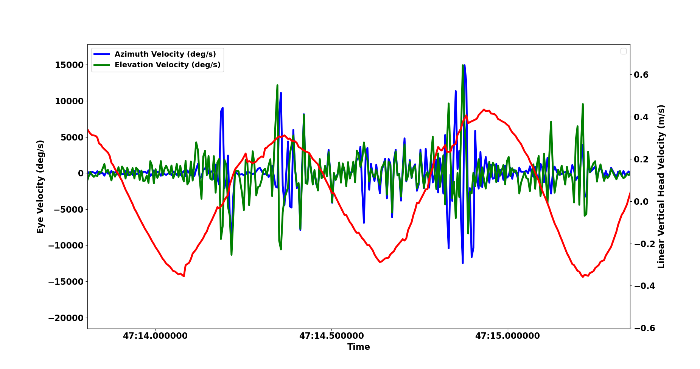

# VEDB Head-Eye Transformations

## Overview
This repository contains Python code for analyzing eye and head movements in the context of the Visual Experience DataBase (VEDB) project. The primary purpose is to transform and analyze eye and head data collected during head-free or head-fixed experiments.

## Code Files

### `eye_head_class.py`
This file defines the `eyeHead` class, which encapsulates the analysis pipeline. It performs various tasks, including calibration, validation, gaze calculation, error computation, and quality control visualization. The code utilizes the VEDB Gaze Analysis package and the VEDB Odometry (odopy) package. Additionally, the class handles head calibration and sets up the reference frame for further analysis.

#### Instructions for Use for Eye-Head Analysis:
1. Run the analysis by executing the `main()` function in the script.

### `pylids_execute.py`
This script runs the Pylids library to analyze eye videos and extract pupil positions. Pylids is a neural network-based method for estimating eyelids and pupils.

#### Instructions for Use for Pylids:
1. Provide the path to the folder containing eye videos as a command-line argument.
2. Execute the script to perform the Pylids analysis and save the results.

### `run_scripts.sh`
This bash script automates the execution of the `pylids_execute.py` and `eye_head_class.py` scripts. It activates the required Conda environments (`vedb_analysis_dlc` and `vedb_analysis38`) and runs the corresponding Python scripts.

#### Instructions for Use both scripts:
1. Run the script with the command `bash -i run_scripts.sh /path/to/folder/` in interactive mode.

## Dependencies
- **For Pylids Execution:** `set_up_vedb_analysis_environment_dlc_py37.sh`
- **For Head-Eye Class:** `set_up_vedb_analysis_environment.sh`

## Citation for Pylids
If you find this code useful, please consider citing the relevant paper:

- **Title:** A framework for generalizable neural networks for robust estimation of eyelids and pupils
- **Authors:** Arnab Biswas, Mark D Lescroart
- **Published in:** Behavior Research Methods (2023)
- **DOI:** [10.3758/s13428-023-02266-3](https://doi.org/10.3758/s13428-023-02266-3)

## Contributors
- [Brian Szekely (bszek213)](https://github.com/bszek213)

## Example Output

Feel free to contribute, report issues, or adapt the code for your specific needs!